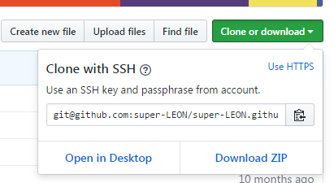

<anchor-md-script>

<div style="display: none;">

[TOC]

</div>

# 前言

这是一篇入门级使用指南，更多详细的请参考 [Git 官网电子书](https://git-scm.com/book/zh/v2)。

在这里将列举一些常用命令和场景解决方案，欢迎大家补充学习。

# 一、Git 简介

## 什么是版本控制系统

### 为什么需要版本 控制

在软件开发过程，每天都会产生新的代码，代码合并的过程中可能会出现如下问题：

- 代码被覆盖或丢失
- 代码写的不理想希望还原之前的版本
- 希望知道与之前版本的差别
- 是谁修改了代码以及为什么修改
- 发版时希望分成不同的版本(测试版、发行版等)

因此，我们希望有一种机制，能够帮助我们：

- 可以随时回滚到之前的版本
- 协同开发时不会覆盖别人的代码
- 留下修改记录，以便随时查看
- 发版时可以方便的管理不同的版本

### 什么是版本控制系统

一个标准的版本控制系统 Version Control System (VCS)，通常需要有以下功能：

- 能够创建 Repository (仓库)，用来保存代码
- 协同开发时方便将代码分发给团队成员
- 记录每次修改代码的内容、时间、原因等信息
- 能够创建 Branch (分支)，可以根据不同的场景进行开发
- 能够创建 Tag (标签)，建立项目里程碑

### 版本控制系统的发展史

版本控制系统发展至今有几种不同的模式：

**Local VCS**

本地使用 `复制/粘贴` 的方式进行管理，缺点是无法协同开发

**Centralized VCS (Lock，悲观锁)**

中央集中式版本控制系统团队共用仓库，当某人需要编辑文件时，进行锁定，以免其他人同时编辑时造成冲突。缺点是虽然避免了冲突，但不是很方便。其他人需要排队才能编辑文件，如果有人编辑了很久或是忘记解锁就会造成其他人长时间等待的情况。

**Centralized VCS (Merge，乐观锁)**

中央集中式版本控制系统团队共用仓库，不采用悲观锁方式来避免冲突，而是事后发现如果别人也修改相同文件(冲突)，再进行手动修改解决。有很多 VCS 属于这种类型，如：CVS，Subversion，Perforce 等

中央集中式版本控制系统的共同问题是，做任何操作都需要和服务器同步，如果服务器宕机则会造成无法继续工作的窘迫。

**Distributed VCS**

分布式版本控制系统，本地也拥有完整的代码仓库，就不会出现上述集中式管理的问题，即使没有网络，依然可以 `commit` 和看 `log`，也无需担心服务器同步问题。如：Git，Mercurial，Bazaar 等就属于分布式版本控制系统。缺点是功能比较复杂，上手需要一定的学习时间。

## 什么是 Git

- Git 是一个开源的分布式版本控制系统，用于敏捷高效地处理任何或小或大的项目。
- Git 是 Linus Torvalds 为了帮助管理 Linux 内核开发而开发的一个开放源码的版本控制软件。
- Git 与常用的版本控制工具 CVS, Subversion 等不同，它采用了分布式版本库的方式，不必服务器端软件支持。

## 如何安装 Git

- Git 官网下载地址：[Git 版本管理工具](https://git-scm.com/downloads)

- 客户端推荐：[SourceTree](https://www.sourcetreeapp.com/)，软件安装跳过注册，[请参考这里](https://www.cnblogs.com/lucio110/p/8192792.html?tdsourcetag=s_pcqq_aiomsg)

# 二、Git 常用命令速查

一图胜千言

<div align="center"> </div>

推荐一个不错的可视化工具：[Git Cheat Sheet](http://ndpsoftware.com/git-cheatsheet.html)

## 配置

设置提交者姓名

```shell
$ git config --global user.name "John Doe"
```

设置提交者邮箱

```shell
$ git config --global user.email johndoe@example.com
```

查看配置列表

```shell
$ git config --list
```

## 基础操作

在指定目录创建仓库，如果没有指定目录名将在当前目录创建仓库

```shell
$ git init [目录名]

# 当前文件夹初始化
$ git init .

# 指定目录
$ git init frank
```

从指定地址克隆仓库，若不指定`目录名`将默认创建与远程同名目录

```shell
$ git clone <远程仓库地址> [目录名]

# 不想创建目录，目录名为 . ，直接加在内容到当前目录下
$ git clone https://github.com/frank-lam/2019_campus_apply.git .
```

将文件或目录中已修改的代码添加追暂存区

```shell
$ git add <目录名|文件名>
```

提交暂存区内容

```shell
$ git commit -m "<注释>"
```

查看仓库状态

```shell
$ git status
```

## 比对 diff

比对当前内容和暂存区内容

```shell
$ git diff
```

比对当前内容和最近一次提交

```shell
$ git diff HEAD
```

比对当前内容和倒数第二次提交

```shell
$ git diff HEAD^
```

比对最近两次提交

```shell
$ git diff HEAD^ HEAD
```

## 历史 log

查看提交历史

```shell
$ git log --oneline
```

打印为单行 log

```shell
$ git log --oneline
```

打印所有记录（忽略 HEAD 的位置）

```shell
$ git log --all
```

打印示意图（忽略 HEAD 的位置）

```shell
$ git log --graph
```

## 分支 branch

查看所有分支

```shell
$ git branch
```

有分支：创建分支，无分支：列出所有分支

```shell
$ git branch [分支]
```

切换至分支

```shell
$ git checkout <分支>
```

创建并切换至分支分支

```shell
$ git checkout -b <分支>
```

将分支与当前分支合并

```shell
$ git merge <分支>
```

## 远程

拉取远程仓库

```shell
$ git pull
```

推送至远程仓库

```shell
$ git push <远程仓库> <分支>
```

新增远程仓库 origin

```shell
$ git remote add origin https://xxx.git
```

修改远程仓库 origin

```shell
$ git remote set-url origin https://xxx.git
```

# 三、Git 常用场景

## 1. 删除本地文件后，想从远程仓库中重新 Pull 最新版文件

Git 提示：up-to-date，但未得到删除的文件

原因：当前本地库处于另一个分支中，需将本分支发 Head 重置至 master

```bash
$ git checkout master
$ git reset --hard
```

git 强行 pull 并覆盖本地文件

```shell
$ git fetch --all
$ git reset --hard origin/master
$ git pull
```

## 2. 储藏与清理

应用场景：

1. 当正在 dev 分支上开发某个项目，这时项目中出现一个 bug，需要紧急修复，但是正在开发的内容只是完成一半，还不想提交，这时可以用 git stash 命令将修改的内容保存至堆栈区，然后顺利切换到 hotfix 分支进行 bug 修复，修复完成后，再次切回到 dev 分支，从堆栈中恢复刚刚保存的内容。
2. 由于疏忽，本应该在 dev 分支开发的内容，却在 master 上进行了开发，需要重新切回到 dev 分支上进行开发，可以用 git stash 将内容保存至堆栈中，切回到 dev 分支后，再次恢复内容即可。

总的来说，git stash 命令的作用就是将目前还不想提交的但是已经修改的内容进行保存至堆栈中，后续可以在某个分支上恢复出堆栈中的内容。这也就是说，stash 中的内容不仅仅可以恢复到原先开发的分支，也可以恢复到其他任意指定的分支上。git stash 作用的范围包括工作区和暂存区中的内容，也就是说没有提交的内容都会保存至堆栈中。

- [Git - 储藏与清理](https://git-scm.com/book/zh/v2/Git-%E5%B7%A5%E5%85%B7-%E5%82%A8%E8%97%8F%E4%B8%8E%E6%B8%85%E7%90%86)
- [git stash 详解 - stone_yw 的博客 - CSDN 博客](https://blog.csdn.net/stone_yw/article/details/80795669)

## 3. SSH 连接配置

### 1. 生成密钥对

大多数 Git 服务器都会选择使用 SSH 公钥来进行授权。系统中的每个用户都必须提供一个公钥用于授权，没有的话就要生成一个。生成公钥的过程在所有操作系统上都差不多。首先你要确认一下本机是否已经有一个公钥。

SSH 公钥默认储存在账户的主目录下的 ~/.ssh 目录。进去看看：

```shell
$ cd ~/.ssh
$ ls
authorized_keys2  id_dsa       known_hosts config            id_dsa.pub
```

看一下有没有 id_rsa 和 id_rsa.pub(或者是 id_dsa 和 id_dsa.pub 之类成对的文件)，有 .pub 后缀的文件就是公钥，另一个文件则是密钥。

假如没有这些文件，甚至连 .ssh 目录都没有，可以用 ssh-keygen 来创建。该程序在 Linux/Mac 系统上由 SSH 包提供，而在 Windows 上则包含在 MSysGit 包里：

```shell
$ ssh-keygen -t rsa -C "your_email@youremail.com"

Creates a new ssh key using the provided email # Generating public/private rsa key pair.

Enter file in which to save the key (/home/you/.ssh/id_rsa):
```

直接按 Enter 就行。然后，会提示你输入密码，如下(建议输一个，安全一点，当然不输也行，应该不会有人闲的无聊冒充你去修改你的代码)：

```shell
Enter same passphrase again: [Type passphrase again]
```

完了之后，大概是这样：

```shell
Your public key has been saved in /home/you/.ssh/id_rsa.pub.
The key fingerprint is: # 01:0f:f4:3b:ca:85:d6:17:a1:7d:f0:68:9d:f0:a2:db your_email@youremail.com
```

到此为止，你本地的密钥对就生成了。

(9+条消息)Mac OS 配置多个 ssh-key - maoxinwen1 的博客 - CSDN 博客
https://blog.csdn.net/maoxinwen1/article/details/80269299

### 2. 添加公钥到你的远程仓库（github）

1. 查看你生成的公钥：

```
$ cat ~/.ssh/id_rsa.pub

ssh-rsa AAAAB3NzaC1yc2EAAAADAQABAAABAQC0X6L1zLL4VHuvGb8aJH3ippTozmReSUzgntvk434aJ/v7kOdJ/MTyBlWXFCR+HAo3FXRitBqxiX1nKhXpHAZsMciLq8vR3c8E7CjZN733f5AL8uEYJA+YZevY5UCvEg+umT7PHghKYaJwaCxV7sjYP7Z6V79OMCEAGDNXC26IBMdMgOluQjp6o6j2KAdtRBdCDS/QIU5THQDxJ9lBXjk1fiq9tITo/aXBvjZeD+gH/Apkh/0GbO8VQLiYYmNfqqAHHeXdltORn8N7C9lOa/UW3KM7QdXo6J0GFlBVQeTE/IGqhMS5PMln3 admin@admin-PC
```

2. 登陆你的 GitHub 帐户。点击你的头像，然后 `Settings -> 左栏点击 SSH and GPG keys -> 点击 New SSH key`

3. 然后你复制上面的公钥内容，粘贴进“Key”文本域内。 title 域，自己随便起个名字。

4. 点击 Add key。

完成以后，验证下这个 key 是不是正常工作：

```shell
$ ssh -T git@github.com

Attempts to ssh to github
```

如果，看到：

```
Hi xxx! You've successfully authenticated, but GitHub does not # provide shell access.
```

恭喜你，你的设置已经成功了。

### 3. 修改 git 的 remote url

使用命令 git remote -v 查看你当前的 remote url

```shell
$ git remote -v
origin https://github.com/someaccount/someproject.git (fetch)
origin https://github.com/someaccount/someproject.git (push)
```

如果是以上的结果那么说明此项目是使用 https 协议进行访问的（如果地址是 git 开头则表示是 git 协议）

你可以登陆你的 github，就像本文开头的图例，你在上面可以看到你的 ssh 协议相应的 url，类似：



复制此 ssh 链接，然后使用命令 git remote set-url 来调整你的 url。

```shell
$ git remote set-url origin git@github.com:someaccount/someproject.git
```

然后你可以再用命令 git remote -v 查看一下，url 是否已经变成了 ssh 地址。

然后你就可以愉快的使用 git fetch, git pull , git push，再也不用输入烦人的密码了

### 4. 常见问题

- [Git 提交大文件提示 fatal: The remote end hung up unexpectedly - WNFK - 博客园](https://www.cnblogs.com/hanxianlong/p/3464224.html)

## 4. Git 记住密码

- [Git Pull 避免用户名和密码方法 - 王信平 - 博客园](https://www.cnblogs.com/wangshuo1/p/5531200.html)

## 5. Git FTP 使用

利用 Git 版本管理将只修改过的文件上传到 FTP 服务器 支持 SFTP 协议 - 吕滔博客
https://lvtao.net/tool/gitftp.html

## 6. Git 删除文件如何提交

## 7. Git 中的 origin 是什么意思

git 学习：关于 origin 和 master - mashiqi - 博客园
https://www.cnblogs.com/mashiqi/p/6002671.html

Git 里面的 origin 到底代表啥意思? - Not Only DBA. - CSDN 博客
https://blog.csdn.net/u011478909/article/details/77683754

## 8. Git 回退到制定版本

**回滚到指定的版本**

```shell
git reset --hard e377f60e28c8b84158
```

**强制提交**

```shell
git push -f origin master
```

</anchor-md-script>
